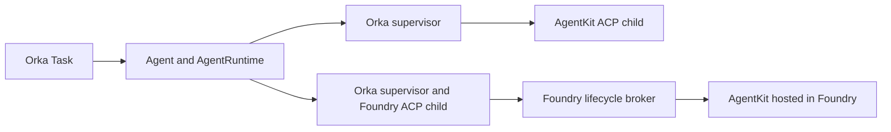

# Fibey with AgentKit, Foundry, and Orka harness v2

Run the same custom AgentKit agent against the same synthetic Quincy North
pump incident through two external `orka.harness.v2` runtimes:



The direct runtime launches `agentkit-serve --protocol acp`. The Foundry runtime
launches `agent-runtime-foundry --protocol acp` and sends Responses requests
through its separate lifecycle broker. Both supervisors expose the v2 contract
to Orka. The hosted AgentKit container exposes Foundry's Responses protocol.

This restores the incident and backend-selection workflow from the v0.1.3 demo.
Each run now creates a new Task and checks its immutable v2 binding. The
baseline uses `workspace.intent: read`, no tools, no repository, and one prompt
per Task. It exercises inference, runtime selection, and execution identity. It does
not establish hosted tool governance, conversation continuation, or recovery
after an ambiguous remote operation.

## Prerequisites

- An Orka installation containing [external v2 dispatch](https://github.com/orka-agents/orka/pull/487), running with `--controller-mode=harness-v2`.
- `kubectl`, `jq`, and access to the controller's watched namespace.
- Two Ready external `AgentRuntime` registrations for the Fibey backends in that namespace:

| Registration | Backend |
| --- | --- |
| `fibey-agentkit-runtime` | AgentKit running directly through ACP |
| `fibey-foundry-runtime` | Foundry ACP bridge calling the same AgentKit agent hosted in Foundry |

The runtime deployment owns registration, credentials, identity, and profile
configuration. Both backends must use the baked Fibey configuration, read
intent, and an empty tool policy. Operators provisioning them can follow
[build and register the backends](build-images.md).

## Connect the Agents

The demo uses the existing registrations through two small Agent resources.
`kustomization.yaml` contains those Agents. Choose the existing v2 controller's
context and watched namespace, then apply them:

```bash
set -euo pipefail
FIBEY_CONTEXT=sertac-aks
FIBEY_NAMESPACE=orka-system

kubectl --context="$FIBEY_CONTEXT" -n "$FIBEY_NAMESPACE" apply \
  -k examples/fibey-custom-agent-demo
```

The namespace must already have `orka.ai/controller-mode: harness-v2`.
The submit helper checks that the selected runtime is Ready for its current
registration generation, instance, and profile before creating a Task.

The Task selects `agentRuntime.allowedTools: []`. Bash denial belongs to the
registered MCP policy. External v2 Tasks must omit `allowBash` entirely;
setting it to `false` is still an unsupported runtime override.

## Run and compare

Run these commands from the Orka checkout. Give every invocation a new Task
name. The helper requires an explicit context and namespace on every run.

```bash
examples/fibey-custom-agent-demo/switch-backend.sh \
  agentkit "$FIBEY_CONTEXT" "$FIBEY_NAMESPACE" fibey-quincy-agentkit-01

examples/fibey-custom-agent-demo/switch-backend.sh \
  foundry "$FIBEY_CONTEXT" "$FIBEY_NAMESPACE" fibey-quincy-foundry-01
```

The helper preserves [task.yaml](task.yaml)'s prompt and read policy, creates
one Task, then checks the controller's immutable binding against the preflight
Agent and AgentRuntime identities. It reports binding success before inference
finishes. It never patches an existing Task or reuses a Session across backends.

Wait for each Task and inspect its v2 result:

```bash
kubectl --context="$FIBEY_CONTEXT" -n "$FIBEY_NAMESPACE" wait \
  --for=jsonpath='{.status.phase}'=Succeeded \
  task/fibey-quincy-agentkit-01 task/fibey-quincy-foundry-01 --timeout=360s

kubectl --context="$FIBEY_CONTEXT" -n "$FIBEY_NAMESPACE" get \
  task/fibey-quincy-agentkit-01 task/fibey-quincy-foundry-01 -o json |
  jq '.items[] | {
    name: .metadata.name,
    phase: .status.phase,
    contract: .status.agentExecutionBinding.contractVersion,
    backend: .status.agentExecutionBinding.backend,
    runtime: .status.execution.agentRuntimeName,
    runtimeUID: .status.execution.agentRuntimeUID,
    instance: .status.execution.runtimeInstanceID,
    attempt: .status.execution.attempt,
    outcome: .status.execution.outcome,
    reason: .status.execution.reason,
    delivery: .status.delivery.state,
    result: .status.result
  }'
```

Expect `orka.harness.v2`, backend `external-endpoint`, the selected registration
name and UID, and `execution.outcome: Succeeded`. `execution.runtimePoolName`
should be absent. `status.harnessRuntime` belongs to v1 and is not the evidence
for these runs. Compare the conclusions and use of evidence, not byte-identical
wording from the models.

If creation, binding, or waiting fails, inspect that exact Task before another
submission. A create error can have an ambiguous result. An existing Task name
must not be reused. `execution.outcome: OutcomeUnknown` is unresolved remote
execution, not a retryable model error. Keep the Task, finalizers, supporting
Secrets, and Foundry ledger until normal cleanup establishes retirement.

After successful settled runs, delete only the Tasks you created. Keep the
runtime services and their ledgers available while Orka finalizes them:

```bash
kubectl --context="$FIBEY_CONTEXT" -n "$FIBEY_NAMESPACE" delete \
  task/fibey-quincy-agentkit-01 task/fibey-quincy-foundry-01 --wait=true --timeout=180s
```

## Hosted supervisor and tool limitations

The baseline hosts AgentKit in Foundry and keeps the v2 supervisor in Kubernetes.
To host the supervisor itself in Foundry, follow the Foundry runtime's
[hosted-v2 package](https://github.com/orka-agents/agent-runtime-foundry/blob/57988dbe9d6b9a5ed2a39ce10b3d5abc8a68a7c7/docs/foundry-hosted-v2.md).
That adds another Hosted Agent and a Kubernetes `--protocol hosted-gateway`
process. Register the gateway Service as `fibey-foundry-runtime`; the Agents,
Task, and submit commands stay the same. The hosted lifetime has bounded
WebSocket connections and needs drain/retirement before replacement.
The operator must register that topology using the
[external runtime contract](../../website/docs/guides/bring-your-own-agent-runtime.md#strict-governed-registration)
before running the demo.

Do not add AgentKit `brokeredTools` to this demo and assume the hosted tool loop
works. At the companion revisions in the [build guide](build-images.md), AgentKit
requires a continuation proof
on hosted `function_call_output`, and the Foundry v2 broker does not forward that
proof. The direct AgentKit ACP tool path is separate. A hosted tool extension
needs a supported continuation-authentication contract and end-to-end validation
before the shared allowlist can change.

## Offline checks

```bash
bash scripts/tests/fibey-v2-demo-test.sh
kubectl kustomize examples/fibey-custom-agent-demo
go test ./internal/admission -run 'Test(Shipped|Documented)ManifestsDecodeStrictly' -count=1
go test ./internal/controller -run TestFibeyDemo -count=1
```

These validate the manifests, controller compatibility, and submission behavior
without a cluster, Azure, or a model. Successful live runs still require the
configured hosted endpoint and provider credentials.
