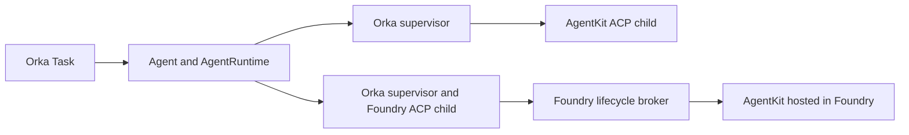

# Fibey with AgentKit, Foundry, and Orka harness v2

Run the same custom AgentKit agent against the same synthetic Quincy North
pump incident through two external `orka.harness.v2` runtimes:



The direct runtime launches `agentkit-serve --protocol acp`. The Foundry runtime
launches `agent-runtime-foundry --protocol acp` and sends Responses requests
through its separate lifecycle broker. Both supervisors expose the v2 contract
to Orka. The hosted AgentKit container exposes Foundry's Responses protocol.

This restores the incident and backend-selection workflow from the v0.1.3 demo.
Each run now creates a new Task and checks its immutable v2 binding. The
baseline uses `workspace.intent: read`, no tools, no repository, and one prompt
per Task. It exercises inference, registration, and execution identity. It does
not establish hosted tool governance, conversation continuation, or recovery
after an ambiguous remote operation.

## Prerequisites

- An Orka installation containing [external v2 dispatch](https://github.com/orka-agents/orka/pull/487), running with `--controller-mode=harness-v2`.
- Source builds containing the [AgentKit ACP changes](https://github.com/sozercan/agentkit/pull/22) and [Foundry v2 changes](https://github.com/orka-agents/agent-runtime-foundry/pull/1). The image instructions use those implementations, not the older static-tools Foundry branch or AgentKit's released v1 renderer.
- `kubectl`, `jq`, and access to the controller's watched namespace.
- Two operator-owned supervisor Services and their conformant v2 registrations. [Build and configure the backends](build-images.md) before running the commands below. This example does not provision an AKS cluster, Foundry project, Azure identity, or model credentials.

The checked-in registrations are inputs to `orka-acp-runtime --export-registration`,
included in supervisor images built from this checkout.
Export them before applying. `kustomization.yaml` includes only the two
reference-only Agents; registration and Task submission are separate steps.

## Register the backends

Use the [external runtime contract](../../website/docs/guides/bring-your-own-agent-runtime.md)
to configure each service and its authentication. The small templates
[agentruntime-agentkit.yaml](agentruntime-agentkit.yaml) and
[agentruntime-foundry.yaml](agentruntime-foundry.yaml) contain the endpoint,
Secret references, expected backend, read intent, and no-tools policy.

The exporter fills the runtime identity, profile hashes, protocol limits, and
governance guarantees from the supervisor's local configuration. These are
required v2 assertions that Orka checks against the running service. They are
not optional tuning parameters. Configure the deployment inputs once:

| Registration | `providerKind` | `adapterName` | Adapter digest | Agent configuration digest |
| --- | --- | --- | --- | --- |
| `fibey-agentkit-runtime` | `agentkit` | `agentkit-serve-acp` | Digest of the Fibey AgentKit source image, before supervisor composition | SHA-256 of the exact baked `/agent/agent.yaml` bytes |
| `fibey-foundry-runtime` | `foundry` | `foundry-serve-acp` | Digest of the configured Foundry ACP source image, before supervisor composition | SHA-256 of the exact baked `/agent/foundry.json` bytes |

Both supervisors use read intent, credential role `operator-managed`,
credential scope `external-runtime`, and resource class `external`. The model
must match the baked configuration. Keep the empty `mcpPolicy` in the templates;
export verifies its digests against the configured profile. The runtime's
`/v2/capabilities` must advertise `supportsAgentSessionConfiguration: false`; that is an HTTP capability,
not an additional field in the AgentRuntime CRD.

The Task selects only `agentRuntime.allowedTools: []`. Keep `allowBash: false`
in the registration's MCP policy; any Task-level `allowBash` value is an
unsupported runtime override, including `false`.

Do not hash the Agentkitfile as the AgentKit configuration digest. AgentKit
renders that input into a different `/agent/agent.yaml` file. Export calculates
the overall `profile.digest` with the same canonicalization as supervisor startup.

Provision each registration's controller-bearer and operation-capability
Secrets separately. Each value must be at least 32 bytes. Both Secrets need
these bindings, with the exact registration name and endpoint:

```yaml
metadata:
  labels:
    orka.ai/agent-runtime-auth: "true"
    orka.ai/agent-runtime-name: fibey-agentkit-runtime
  annotations:
    orka.ai/agent-runtime-endpoint: http://fibey-agentkit-runtime.orka-system.svc.cluster.local:8080
```

Mount those values into the matching supervisor. Keep model credentials
separate. For Foundry, only the broker receives Azure identity and access to its
private durable ownership ledger. No credential values belong in these
manifests or images.

Set `ORKA_ACP_RUNTIME_INSTANCE_ID` explicitly for each supervisor lifetime;
export requires it. Set `ORKA_ACP_CONTROLLER_EPOCH` to the current controller
epoch before starting either supervisor. Its operator must handle epoch changes
as described in the external runtime contract. A stale supervisor cannot accept
new Tasks. Do not replace a Foundry lifetime or delete its ledger while remote
ownership remains unresolved.

Use the context and namespace of an existing v2 installation. The namespace
must already have `orka.ai/controller-mode: harness-v2` and be watched by that
controller. Adjust copies of the templates and the Secret endpoint annotations
together if your names or namespace differ. The following example assumes the
controller watches `orka-system`, the Deployments use the registration names,
and their supervisor containers are named `supervisor`.

```bash
set -euo pipefail
FIBEY_CONTEXT=sertac-aks
FIBEY_NAMESPACE=orka-system
FIBEY_TEMPLATES=examples/fibey-custom-agent-demo
FIBEY_REGISTRATIONS="$(mktemp -d)"

for backend in agentkit foundry; do
  kubectl --context="$FIBEY_CONTEXT" -n "$FIBEY_NAMESPACE" exec -i \
    "deployment/fibey-${backend}-runtime" -c supervisor -- \
    /usr/local/bin/orka-acp-runtime --export-registration \
    < "$FIBEY_TEMPLATES/agentruntime-${backend}.yaml" \
    > "$FIBEY_REGISTRATIONS/agentruntime-${backend}.yaml"
done
```

Export reads non-secret profile settings, writes YAML, and exits. It does not
read credential files or create sessions. A mismatched backend, workspace
intent, or policy digest stops export. It requires the configured supervisor's
environment; running the binary on an unconfigured workstation is insufficient.

Inspect the generated registrations, then apply them. Export does not establish
readiness; authenticated status and Orka's conformance checks still decide that.

```bash
kubectl --context="$FIBEY_CONTEXT" -n "$FIBEY_NAMESPACE" apply -f "$FIBEY_REGISTRATIONS/"
kubectl --context="$FIBEY_CONTEXT" -n "$FIBEY_NAMESPACE" wait \
  --for=jsonpath='{.status.ready}'=true \
  agentruntime/fibey-agentkit-runtime agentruntime/fibey-foundry-runtime --timeout=180s

kubectl --context="$FIBEY_CONTEXT" -n "$FIBEY_NAMESPACE" apply \
  -k examples/fibey-custom-agent-demo
```

`GET /v2/health` and `GET /v2/capabilities` are safe unauthenticated probes.
Readiness also requires authenticated status and Orka's conformance checks;
an HTTP 200 from health alone is insufficient. The submit helper checks that
the Ready status belongs to the current registration generation and profile.

## Run and compare

Run these commands from the Orka checkout. Give every invocation a new Task
name. The helper requires an explicit context and namespace on every run.

```bash
examples/fibey-custom-agent-demo/switch-backend.sh \
  agentkit "$FIBEY_CONTEXT" "$FIBEY_NAMESPACE" fibey-quincy-agentkit-01

examples/fibey-custom-agent-demo/switch-backend.sh \
  foundry "$FIBEY_CONTEXT" "$FIBEY_NAMESPACE" fibey-quincy-foundry-01
```

The helper preserves [task.yaml](task.yaml)'s prompt and read policy, creates
one Task, then checks the controller's immutable binding against the preflight
Agent and AgentRuntime identities. It reports binding success before inference
finishes. It never patches an existing Task or reuses a Session across backends.

Wait for each Task and inspect its v2 result:

```bash
kubectl --context="$FIBEY_CONTEXT" -n "$FIBEY_NAMESPACE" wait \
  --for=jsonpath='{.status.phase}'=Succeeded \
  task/fibey-quincy-agentkit-01 task/fibey-quincy-foundry-01 --timeout=360s

kubectl --context="$FIBEY_CONTEXT" -n "$FIBEY_NAMESPACE" get \
  task/fibey-quincy-agentkit-01 task/fibey-quincy-foundry-01 -o json |
  jq '.items[] | {
    name: .metadata.name,
    phase: .status.phase,
    contract: .status.agentExecutionBinding.contractVersion,
    backend: .status.agentExecutionBinding.backend,
    runtime: .status.execution.agentRuntimeName,
    runtimeUID: .status.execution.agentRuntimeUID,
    instance: .status.execution.runtimeInstanceID,
    attempt: .status.execution.attempt,
    outcome: .status.execution.outcome,
    reason: .status.execution.reason,
    delivery: .status.delivery.state,
    result: .status.result
  }'
```

Expect `orka.harness.v2`, backend `external-endpoint`, the selected registration
name and UID, and `execution.outcome: Succeeded`. `execution.runtimePoolName`
should be absent. `status.harnessRuntime` belongs to v1 and is not the evidence
for these runs. Compare the conclusions and use of evidence, not byte-identical
wording from the models.

If creation, binding, or waiting fails, inspect that exact Task before another
submission. A create error can have an ambiguous result. An existing Task name
must not be reused. `execution.outcome: OutcomeUnknown` is unresolved remote
execution, not a retryable model error. Keep the Task, finalizers, supporting
Secrets, and Foundry ledger until normal cleanup establishes retirement.

After successful settled runs, delete only the Tasks you created. Keep the
runtime services and their ledgers available while Orka finalizes them:

```bash
kubectl --context="$FIBEY_CONTEXT" -n "$FIBEY_NAMESPACE" delete \
  task/fibey-quincy-agentkit-01 task/fibey-quincy-foundry-01 --wait=true --timeout=180s
```

## Hosted supervisor and tool limitations

The baseline hosts AgentKit in Foundry and keeps the v2 supervisor in Kubernetes.
To host the supervisor itself in Foundry, follow the Foundry runtime's
[hosted-v2 package](https://github.com/orka-agents/agent-runtime-foundry/blob/57988dbe9d6b9a5ed2a39ce10b3d5abc8a68a7c7/docs/foundry-hosted-v2.md).
That adds another Hosted Agent and a Kubernetes `--protocol hosted-gateway`
process. Register the gateway Service as `fibey-foundry-runtime`; the Agents,
Task, and submit commands stay the same. The hosted lifetime has bounded
WebSocket connections and needs drain/retirement before replacement.
Use the full [external registration](../../website/docs/guides/bring-your-own-agent-runtime.md#strict-governed-registration)
for that topology; the `kubectl exec` export commands above require a supervisor
container running in Kubernetes.

Do not add AgentKit `brokeredTools` to this demo and assume the hosted tool loop
works. At the companion revisions above, AgentKit requires a continuation proof
on hosted `function_call_output`, and the Foundry v2 broker does not forward that
proof. The direct AgentKit ACP tool path is separate. A hosted tool extension
needs a supported continuation-authentication contract and end-to-end validation
before the shared allowlist can change.

## Offline checks

```bash
bash scripts/tests/fibey-v2-demo-test.sh
kubectl kustomize examples/fibey-custom-agent-demo
go test ./internal/admission -run 'Test(Shipped|Documented)ManifestsDecodeStrictly' -count=1
go test ./internal/controller -run TestFibeyDemo -count=1
go test ./workers/acp/supervisor -run TestExportRegistration -count=1
```

These validate the manifests, controller compatibility, and submission behavior
without a cluster, Azure, or a model. Successful live runs still require the
configured hosted endpoint and provider credentials.
